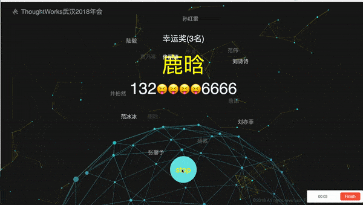

# Magpie

Magpie，“喜鹊”，取其“报喜”之意，故本系统是一款抽奖软件。Magpie目前采用纯前端编写而成，主要技术架构是ReactJs+Redux，部分UI的实现使用了React调用Jquery的方案。

## 使用

本项目已Docker化并托管于Docker hub平台，您可以在安装了Docker环境的情况下执行：

`docker run -p 80:80 bywang/magpie`启动Magpie抽奖服务

你也可以clone本项目，在本地使用`yarn start` 启动服务

## 预览
[Try online](https://magpie.wangbaiyuan.cn/)

